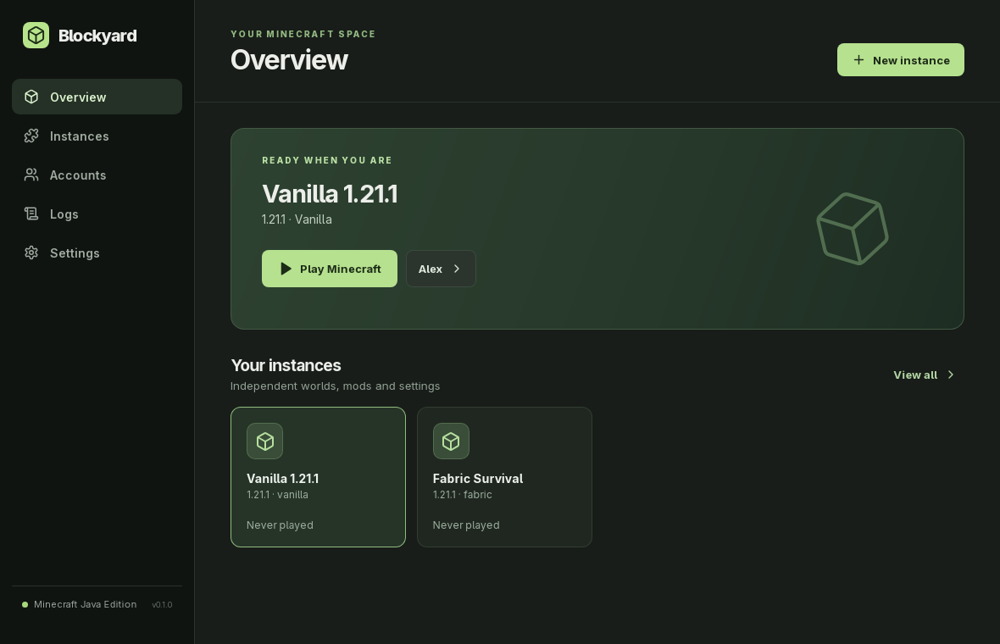
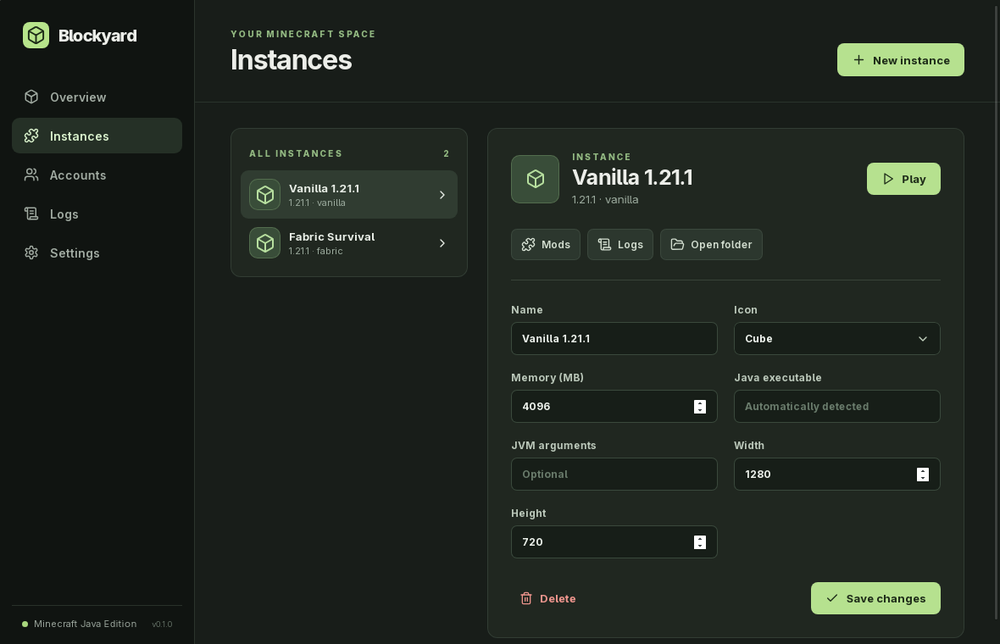
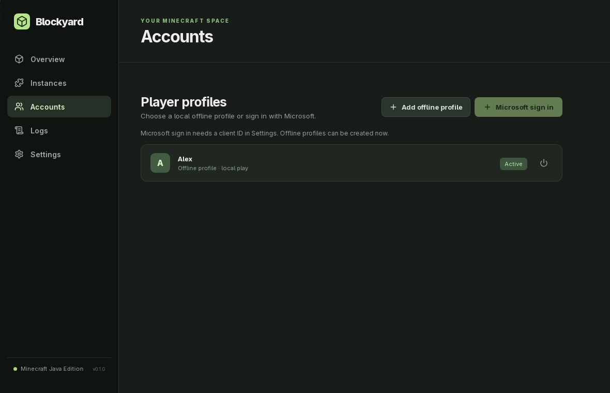
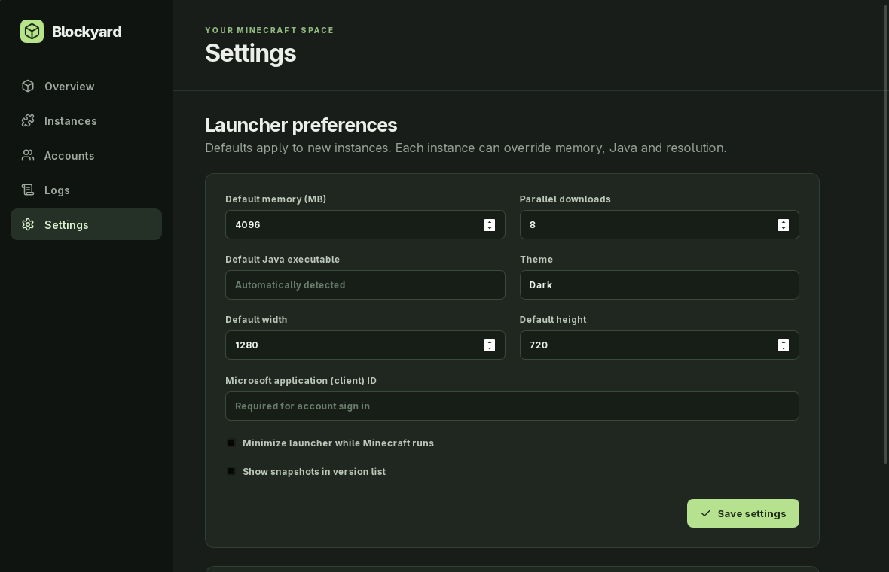

# Blockyard

Blockyard is a Tauri 2 desktop launcher for Minecraft Java Edition. It keeps game directories independent while sharing downloaded game files, libraries, assets and Java runtimes.

## Screenshots

Screenshots use a separate sample offline profile. No personal account data is included.









## Download and install

Download the installers from the [latest GitHub release](https://github.com/sykia/blockyard/releases/latest).

- **Windows:** run the `-setup.exe` NSIS installer. The installer is currently unsigned, so Windows may ask you to confirm it.
- **Arch Linux:** download `blockyard-0.3.1-1-x86_64.pkg.tar.zst`, then install it with `sudo pacman -U ./blockyard-0.3.1-1-x86_64.pkg.tar.zst`. The package adds a desktop launcher and declares its WebKitGTK runtime dependencies. This is a release package for `pacman -U`; it is not in the official Arch repositories.
- **Other Linux:** use the AppImage, or install the DEB with `sudo apt install ./*.deb` or the RPM with `sudo dnf install ./*.rpm`, as appropriate for your distribution. Make the AppImage executable with `chmod +x ./*.AppImage` before running it.

The GitHub Actions workflow builds Windows, AppImage, DEB, RPM and Arch packages for each version tag. Update artifacts are signed with a Tauri updater key; `latest.json` contains the signed update feed. Windows installers are not Authenticode signed, so Windows may still show an Unknown Publisher warning. Release assets include SHA-256 checksums.

## Build and run

Requirements: Rust stable, Node.js 20+, npm, and the [Tauri 2 system prerequisites](https://v2.tauri.app/start/prerequisites/). On Arch Linux:

```bash
sudo pacman -S --needed webkit2gtk-4.1 base-devel curl wget file openssl appmenu-gtk-module libappindicator librsvg xdotool
```

```bash
npm install
npm run tauri dev
npm run build
npm run tauri build
```

On Linux, the launcher disables WebKitGTK's DMA-BUF renderer to avoid a blank window on affected graphics drivers. If XWayland is available in a Wayland session, it also selects GTK's X11 backend. Explicit `WEBKIT_DISABLE_DMABUF_RENDERER` and `GDK_BACKEND` environment values take precedence. If your compositor does not provide XWayland, start with `GDK_BACKEND=wayland`.

To apply the same workaround when launching an older build that still shows a blank window, use:

```bash
GDK_BACKEND=x11 WEBKIT_DISABLE_DMABUF_RENDERER=1 npm run tauri dev
```

### Hyprland window placement

On Hyprland, Blockyard asks the compositor to float and center its main window at startup. This works in packaged builds too and does not edit the user's Hyprland configuration. It uses `hyprctl` with the Lua dispatcher syntax on Hyprland 0.55+ and falls back to the legacy syntax on older releases. The initial 1180×760 size comes from `src-tauri/tauri.conf.json`.

The app data directory is chosen by Tauri (`app.blockyard.launcher`). It contains `state.json`, `instances/<id>/game`, a shared `libraries` directory, `assets`, `cache`, and managed `runtimes`. The operating system keyring stores Microsoft refresh and Minecraft access tokens. Do not copy an instance's `game` directory while Minecraft is running.

Choose **Dark**, **Light**, or **System** in **Settings → Theme**, then save the launcher settings. The selection is stored with other launcher preferences; System follows the operating system's light/dark preference, including changes while Blockyard is open. Selecting a theme previews it immediately, and leaving Settings without saving restores the saved theme.

**Settings → Enable interface animations** controls page entrances, dialogs, cards, buttons, inputs and progress transitions. The choice previews immediately and is saved with launcher settings; the operating system's Reduce Motion preference takes priority. The app header is a native Tauri drag area, so a floating window follows the pointer using the window manager's normal movement. Window movement effects themselves are controlled by the operating system or compositor, not by the web interface.

File integrity checks stream SHA-1 from disk in fixed-size chunks to avoid loading large JARs into memory. Download progress events are limited for large batches, and live game logs are updated in groups while the Logs screen is open. These changes keep the interface responsive during installs and noisy game sessions.

## Account setup

**Offline profiles:** Open Accounts → Add offline profile and choose a 3–16 character Minecraft player name. The launcher derives Minecraft's stable offline UUID from that name. Offline profiles need no Microsoft client ID and work for singleplayer and servers that permit offline players. They do not prove Minecraft ownership and cannot join online-mode servers. Changing the name creates a different UUID, so existing worlds may treat it as a different player.

**Microsoft accounts:** Blockyard does not ship a Microsoft application ID. Register your own public desktop application in Microsoft Entra, allow personal Microsoft accounts and public client/device code flow, then enter its **client ID** in Launcher Settings. No client secret belongs in a desktop app. The sign-in button starts Microsoft's device authorization flow, opens the verification URL in the system browser, then exchanges the Microsoft token through Xbox Live, XSTS and Minecraft Services. A Minecraft Java profile is required. Refresh tokens are kept in the system keyring, never in `state.json`.

Minecraft Services may require separate approval for the application ID. An unapproved ID can authenticate with Microsoft but fail at `login_with_xbox` with HTTP 403. This approval is external to Blockyard; do not reuse another launcher's ID. See the [Microsoft device flow documentation](https://learn.microsoft.com/entra/identity-platform/v2-oauth2-device-code) and the [Minecraft application registration discussion](https://learn.microsoft.com/en-gb/answers/questions/5984225/minecraft-services-http-403-invalid-app-registrati).

## Launch flow

1. Read Mojang's [version manifest v2](https://piston-meta.mojang.com/mc/game/version_manifest_v2.json), select a release or enabled snapshot, and download its version JSON.
2. For Fabric, read its [Meta API launcher profile](https://github.com/FabricMC/fabric-meta/blob/master/README.md) and merge its libraries and arguments with the inherited vanilla version. For NeoForge, map both legacy `1.x` and current `26.x` version schemes, download the official installer from its Maven repository, verify its published SHA-1 and run `--install-client` with a private launcher root; then read the installed profile.
3. Resolve rule filtered libraries and natives; verify SHA-1 and size where available. Download the client JAR, logging configuration, asset index and asset objects into a shared cache. Downloads run concurrently and use temporary files and retries.
4. Select Java by the version JSON's `javaVersion.majorVersion`, inspect installed Java, or download Eclipse Temurin JRE via the [Adoptium API](https://adoptium.net/installation/ci-scripts/) and verify SHA-256. An instance can override Java explicitly.
5. Extract only native library files, build arguments as a process argument vector, and launch in the instance's private game directory. The launcher streams stdout/stderr and records exit status, latest.log and crash reports.

## Architecture

`src-tauri/src/metadata.rs` parses Mojang metadata and rule based arguments. `download.rs` owns verified file acquisition. `engine.rs` assembles the launch. `auth.rs` owns the Microsoft/Xbox/Minecraft token chain; `offline.rs` creates local identities. `neoforge.rs` owns the official installer integration. `java.rs` finds or provisions runtimes. `store.rs` persists nonsecret state atomically. `hyprland.rs` handles optional floating window placement. `catalog.rs` integrates Modrinth and CurseForge project search, version selection, dependency downloads and pack imports. React in `src/main.tsx` handles navigation and live status; `src/views/` contains the instance, account, mod, settings and log screens.

## Modrinth and CurseForge catalogs

Open **Discover** to search Modrinth or CurseForge for mods and modpacks. Search results show project icons; selecting a project loads its full description, screenshots and available files. External links in descriptions open in the system browser. For a mod, select a Fabric or NeoForge instance; search and available versions are filtered by its Minecraft version and loader. Installation places the JAR in that instance and installs required dependencies. For a modpack, select a release and choose **Install as new instance**. Blockyard reads the `.mrpack` or CurseForge manifest, creates an independent instance, downloads its required files and applies client overrides. Pack imports validate paths and archive sizes; a failed import is removed. Minecraft itself is installed when the new instance is first launched.

Modrinth public catalog access needs no key. CurseForge requires an [official API key](https://support.curseforge.com/support/solutions/articles/9000208346-about-the-curseforge-api-and-how-to-apply-for-a-key). Apply through CurseForge, then paste the key in **Settings → CurseForge catalog**. The Discover screen links to these instructions when no key is configured. The key is stored in the operating system keyring, not `state.json` or the repository, and is also sent to CurseForge's authenticated download CDN when required. CurseForge's terms do not allow distributing one private key with the launcher. A CurseForge project may disallow third party downloads; Blockyard respects this and reports that the file cannot be installed. Some packs require Forge or Quilt, which Blockyard cannot currently launch.

## Launcher updates

Packaged builds from **0.3.1 onward** check for updates when Settings opens. Click **Install** to download a signed release artifact. The Settings screen shows download progress and verifies its signature before installation. The GitHub Actions release workflow signs every Windows, AppImage, DEB, RPM and Arch artifact, then publishes `latest.json` after all platform builds succeed. The signing private key is stored as the `TAURI_SIGNING_PRIVATE_KEY` GitHub Actions secret; the public key is embedded in the Tauri configuration. Never commit the private key.

- **Arch package:** Blockyard opens a terminal and runs `sudo pacman -U` on the verified package. Type your sudo password in the terminal and watch pacman output.
- **DEB / RPM:** Blockyard opens a terminal with `sudo apt-get install` or `sudo dnf install` (with `rpm -Uvh` fallback) for the verified package.
- **AppImage:** Tauri replaces the signed AppImage directly; no system password is required.
- **Windows:** The signed updater downloads the NSIS installer. Its installation UI shows progress and Windows prompts for administrator approval for the machine-wide installation mode.

Restart Blockyard after Linux installation. The **Restart** button is available in Settings. The 0.2.0 release had no configured update feed or signing key, so upgrade from 0.2.0 to 0.3.1 once using the installer from GitHub; later releases update in the app. A terminal application (`kitty`, Konsole, xterm, Alacritty or GNOME Terminal) and `sudo` are required for system package updates on Linux.

## Current limits

- A project owned Microsoft client ID with Minecraft Services permission is required for Microsoft sign in. Offline profiles work without one.
- NeoForge support is implemented through the official installer, but has not been exercised end to end against a signed in account in this environment.
- Self-update is available in packaged 0.3.1+ builds. Older builds need one manual upgrade. The Windows installer has a Tauri updater signature but no Authenticode publisher certificate.
- Older release asset layouts may require additional compatibility work. Current release metadata is the primary target. Windows and macOS builds have not been exercised end to end; the current OS version range probe is implemented for Unix and needs a native Windows version provider.
- Catalog installations resolve required mod dependencies and keep each pack in its own instance. Optional dependencies are not selected automatically. CurseForge requires a user supplied API key, and packs that require Forge or Quilt are unsupported.
- On Arch Linux, the production binary was built and launched with WebKitGTK 4.1 through XWayland. Its Hyprland window opened floating at 1180×760 without a per-user rule. A complete game session has not yet been verified here.

## License

MIT. See [LICENSE](LICENSE).
